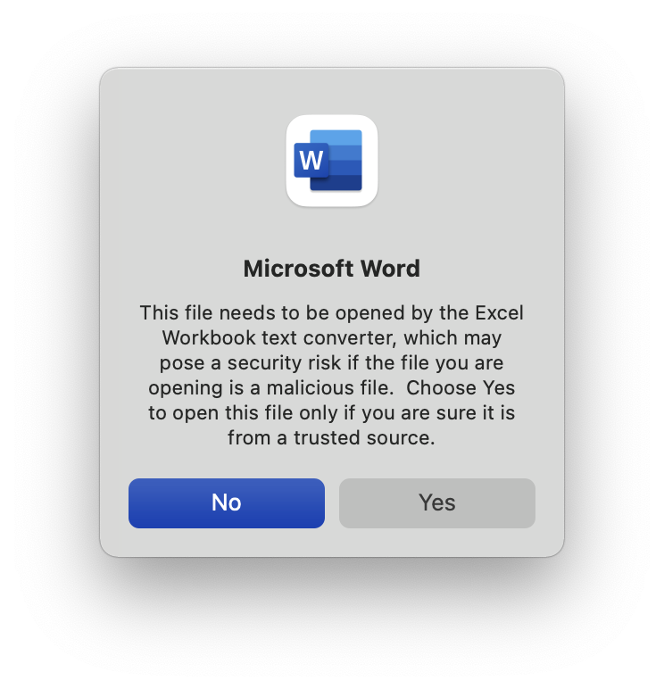
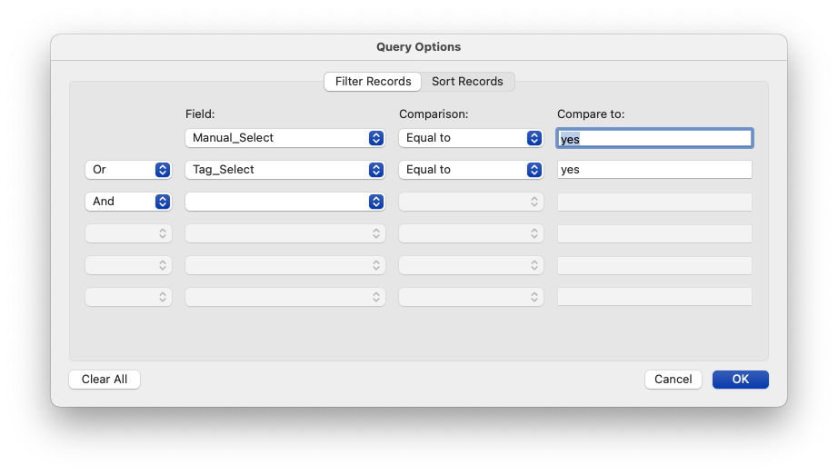
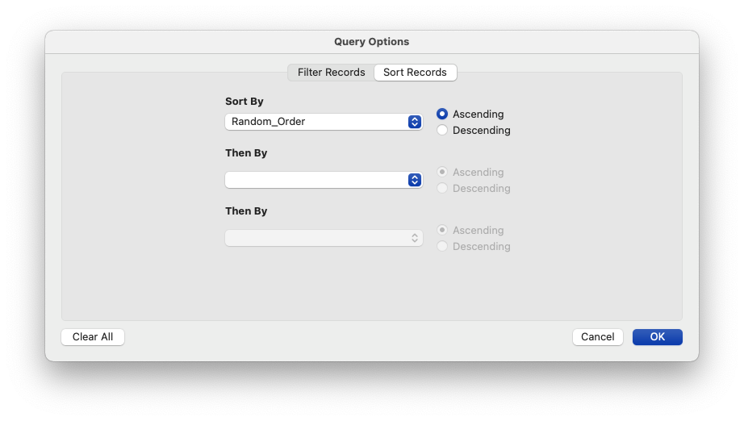

# Mail Merge Question Bank

## How to Use

`Question Bank.xlsx` represents the catalog of all available multiple choice questions. Every time the file is saved, the random ordering of both questions and answer options is updated by Excel.

## In `Question Bank.xlsx`

### On the `Question Bank` worksheet...

#### Add a new question

In the next available row of the Question Bank, enter the question in the `Question` column, followed by the multiple choice options in each of the `Option 1`, `Option 2`, etc. columns. If there are fewer options than columns, fill the columns from left-to-right (leave higher-number options blank).

Indicate which answer is correct in the `Correct` column by entering the number of the correct option.

Add subject tags to in the `Tags` column. Subject tags should be all lower case, separated by commas.

_If the gray text columns do not populate as you go, you may need to "fill down": select the last row of populated gray text, position the mouse at the bottom-right corner of the selection, and then drag the box down (a lot) more rows to fill in those rows with the formulas necessary._

#### Manually select a question

You can manually select a question for inclusion in the next generated test by entering `Yes` in the `Manual Select` column.

#### Edit an existing question

Edit _only_ the fields with black text: fields with gray text are automatically generated by the spreadsheet formulas.

#### Delete a question

You may delete the entire row (right-click on the row the number).

### On the `Parameters` worksheet...

#### Select questions by tag

In the yellow zone of the `Select Tags` column, you can enter up to 20 subject tags that will be automatically selected for inclusion in the test, one tag per row.

## In `Test Generator.docx`

The `Test Generator.docx` file formats the selected questions for use in a test or answer key.

When you open the `Test Generator.docx`, Word will give you a warning about opening the question bank Excel file:

Click <kbd>Yes</kbd>.

When the file opens, do **not** play with the formatting (there are a lot of Word field codes hidden in there that you don't want to scramble).

Under the `Mailings` ribbon, you can...

#### Generate a Test

Click the `Finish & Merge` button in the ribbon, and choose `Edit Individual Documents…`. When asked if this is the test key, answer either yes or no and click `OK`. A new, generated document will open with the selected questions inserted and formatted.

You can save this document, edit it, append it to other questions, etc.

#### Filter Questions

If you click on the `Filter Recipients` button in the ribbon, you can choose different filter criteria to select questions. By default, the filters are set to work on the `Manual Select` and `Tag Select` fields of the question bank spreadsheet:

#### Sort Questions

If you click on the `Filter Recipients` button in the ribbon and choose the `Sort Records` tab at the top of the window, you can alter the sort order of the questions. By default, the sort order is based on the randomization set in the `Random Order` colun of the question bank.

